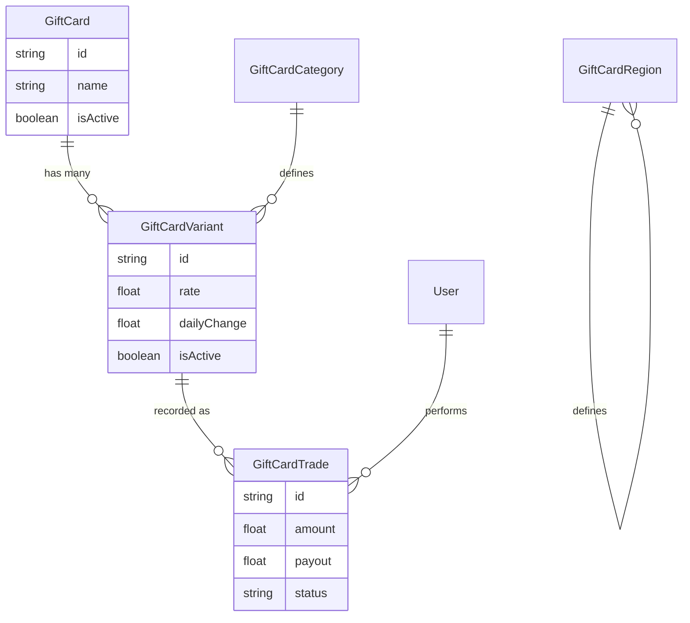

# Gift Card Trading Architecture

The XBanka Gift Card system is built for dynamism and granular control, modeled after industry leaders like Cardtonic and Paxful.

## Core Hierarchy

### 1. GiftCard (The Brand)
This represents the top-level entity (e.g., **Apple**, **Amazon**, **Steam**). It holds the brand name and logo.

### 2. GiftCardCategory
Flexible categories that define the form of the card.
- **Physical**: Cards with a physical presence and receipt.
- **E-code**: Digital-only codes.

### 3. GiftCardRegion
Geographic regions where the card was issued.
- **USA**, **UK**, **Canada**, **Germany**, etc.

### 4. GiftCardVariant (The Master Logic)
This is the bridge that connects everything. A variant is a unique combination of **Brand + Category + Region**.
- *Example:* `Apple` + `Physical` + `USA`
- The **Rate** (e.g., 750 NGN/$) and **Status** (Active/Inactive) are stored here.
- This allows the platform to disable "Apple UK E-codes" while keeping "Apple USA Physical" active.

## Trading Workflow

1. **Discovery**: Gateway fetches the catalog via `GET /gift-cards`. Each brand comes with its list of available `variants`.
2. **Selection**: The user selects a specific variant (e.g., Amazon USA Physical).
3. **Submission**: The user submits a trade via `POST /gift-cards/sell` using the `variantId`.
4. **Validation**: The `gift-card-service` ensures the variant is active and calculates the payout based on the variant's specific rate.
5. **Real-time Updates**: Rates are streamed via SSE (`/gift-cards/stream`) targeting specific variants.

## Data Model

